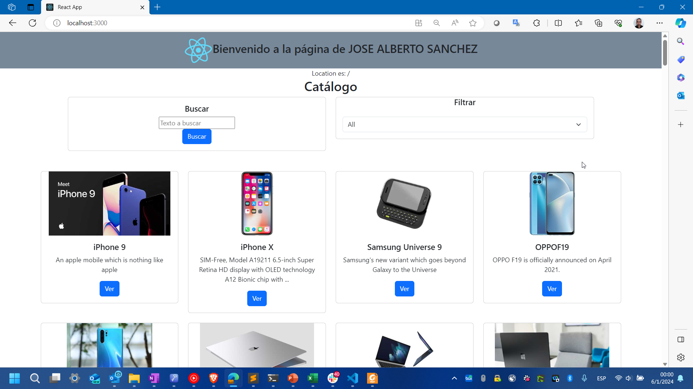
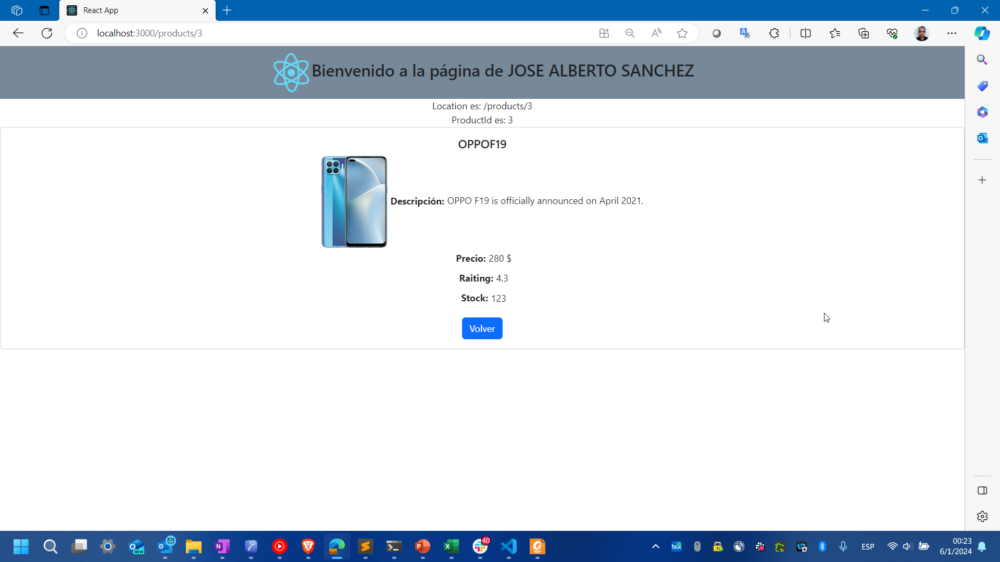

# Product list example using React

Solution for **P2_productos** from React course by UPM taken in MiriadaX.

This project shows how render a product list using React Routes and filter the result by category.

    
    

## Requirements

- NodeJS 16 (LTS)+

## Setup

1. Install dependencies `npm install`
2. Run project `npm start`
